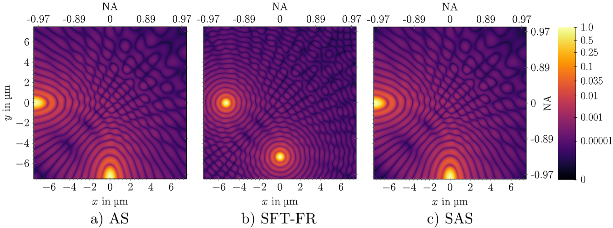

# Scalable Angular Spectrum Method SAS
Implementations of the Scalable Angular Spectrum (SAS) method for optical wave propagation in Python + PyTorch and Julia Lang.
The SAS allows to propagate optical waves accurately over long distances and high magnifications. 
It features a much higher speed than the Angular Spectrum (AS) method and is more precise than the single-step Fresnel (SFT-Fr) method.
It's implementation essentially consists of three FFTs and some phase factors.

This image compares the three methods for accuracy.


The calculation time for Fresnel was 0.04s, the one for SAS around 0.12s. But AS takes around 6s because of large padding!

# Publication and Citation
For more details about the mathematics and physics behind this method, see this [preprint](https://preprints.opticaopen.org/articles/preprint/Scalable_angular_spectrum_propagation/23498453).
Please consider citing this, if you find it useful:
```
@article{Heintzmann2023,
author = "Rainer Heintzmann and Lars Loetgering and Felix Wechsler",
title = "{Scalable angular spectrum propagation}",
year = "2023",
month = "6",
url = "https://preprints.opticaopen.org/articles/preprint/Scalable_angular_spectrum_propagation/23498453",
doi = "10.1364/opticaopen.23498453.v1"
}
```

# License
Check the conditions of the [license](LICENSE).


# Julia Code
Tested with [Julia 1.9](https://julialang.org/downloads/). Download the software and install it on your computer. 
Open the REPL and type (type really a `]` to enter the package manager. Delete the `]` to go back to REPL):
```julia
julia > ]add Pluto

julia > using Pluto
```
[Pluto.jl](https://github.com/fonsp/Pluto.jl) is an interactive notebook environment.
Download the file [SAS_examples.jl](SAS_examples.jl). From within Pluto, open this file.
Everything should go fine from now on.

## Reproducibility
Pluto notebooks are highly reproducible because of the pinned versions of all dependencies. So running this notebook with Julia 1.9.1 is reproducible. You do not have to handle the versions yourself. Everything is done by Pluto.jl.

# Python
Implementation in Python and [PyTorch](https://pytorch.org/). Hence, it can be used within neural networks and automatic differentiation.
See this [Jupyter notebook](SAS_pytorch.ipynb).
Install
```
pip install numpy matplotlib torch notebook
```
to run the Python notebook.

# Bugs, Issues
Please feel free to file issues and bugs here on GitHub! Also, if you have any question regarding the paper, post it here too!
